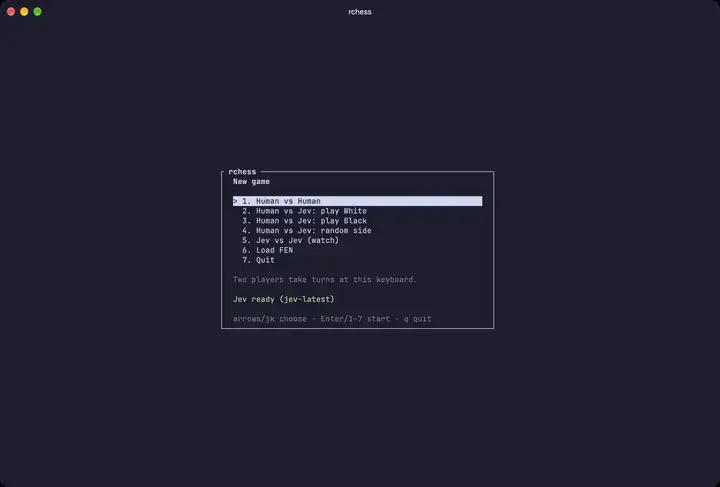
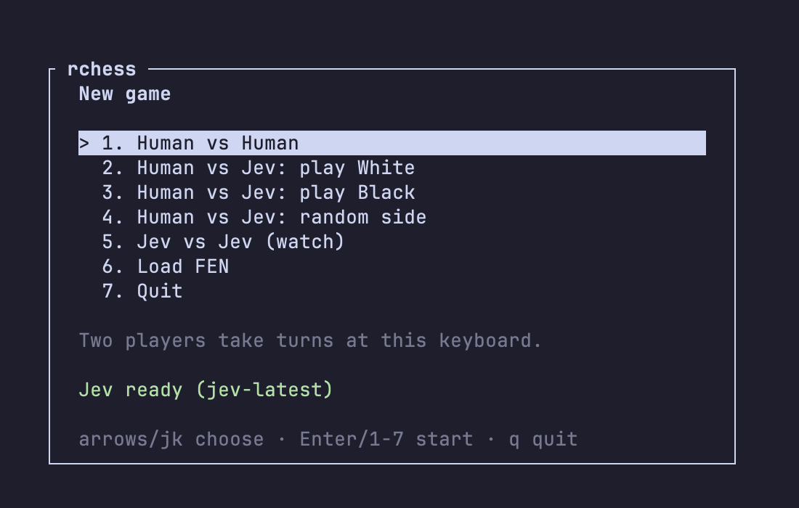
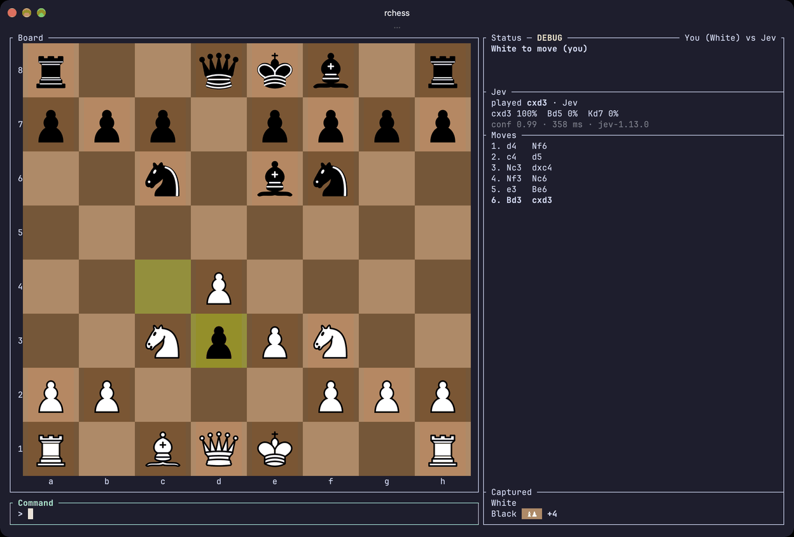
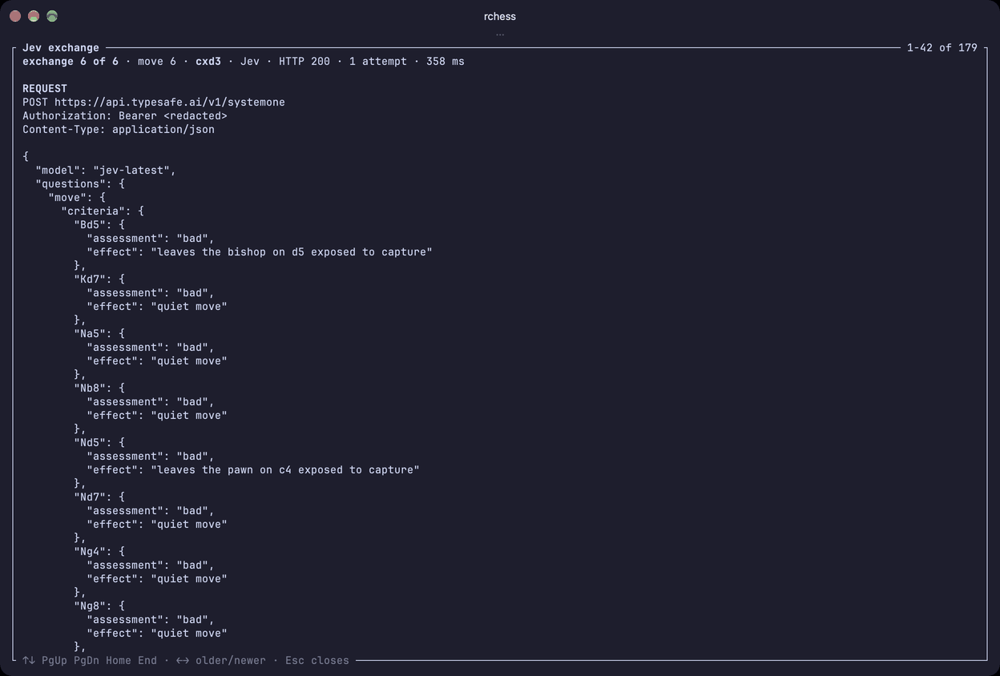
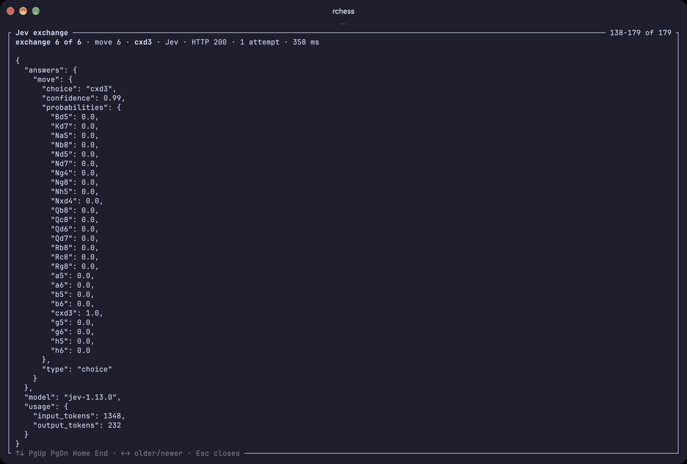
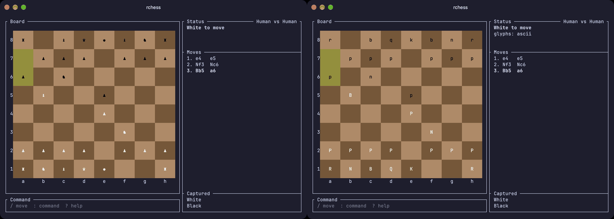
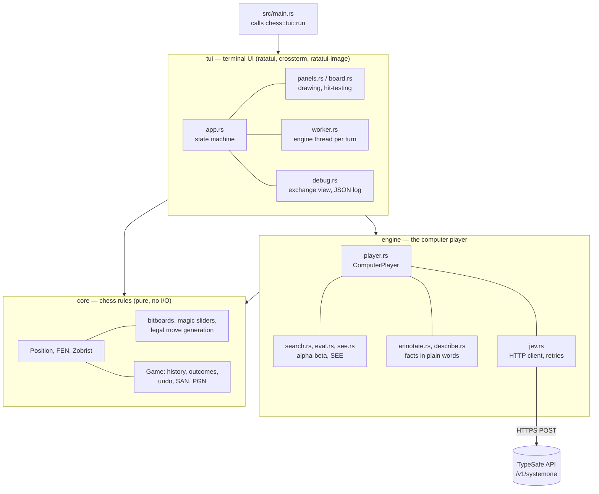
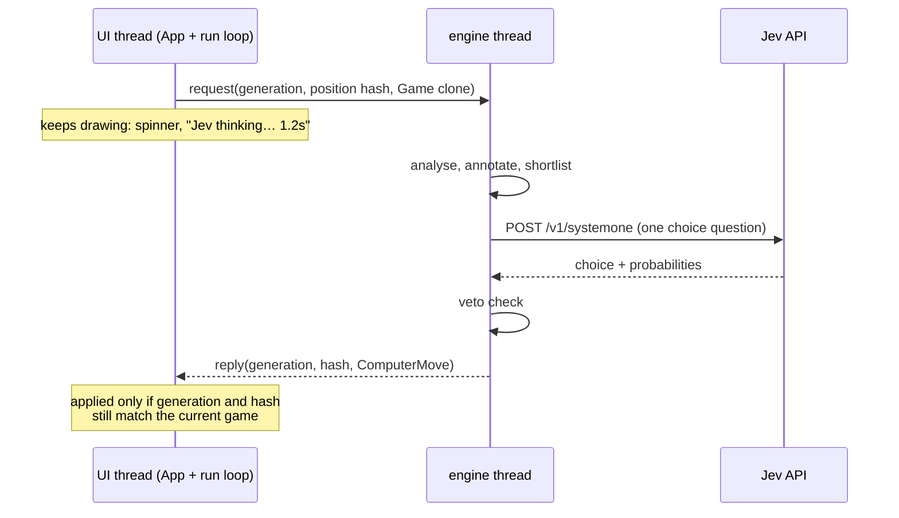
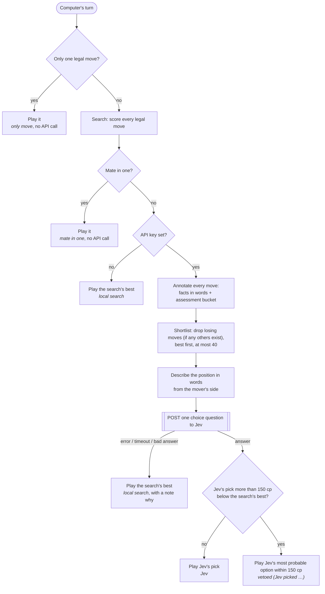

# rchess

Chess in the terminal, written in Rust. Play against a friend at the same keyboard, against
**Jev** (TypeSafe's System One model), or sit back and watch Jev play itself. The board fills the
terminal and draws real piece pictures in terminals that support graphics (Ghostty, Kitty,
WezTerm, iTerm2, Sixel terminals), with text pieces everywhere else.

<p align="center">
  <a href="docs/media/play-vs-jev.mp4">
    
  </a>
  <br>
  <sub>Human vs Jev in Ghostty (sped up where Jev is thinking). Click for the MP4.</sub>
</p>

The computer player is a hybrid. Rust code owns everything that has to be exact: the rules, a
small alpha-beta search, and the tactical facts about every legal move. Jev gets that position
and those moves **in plain words** and makes the judgment call: which move to play. Code then
checks Jev's pick against the search and vetoes blunders. If Jev is not configured, slow or
down, the game carries on with the local search.

- [Screenshots and videos](#screenshots-and-videos)
- [Quick start](#quick-start)
- [Playing](#playing)
- [Architecture](#architecture)
- [How Jev plays](#how-jev-plays)
- [Why it works this way](#why-it-works-this-way)
- [Debug mode](#debug-mode)
- [Configuration](#configuration)
- [Development](#development)

## Screenshots and videos

All captured from the release build running in Ghostty (150×44 cells).

| | |
| --- | --- |
|  |  |
| **Menu.** The status line says whether Jev is ready or the computer will use local search. | **Human vs Jev.** The Jev panel shows where the move came from, Jev's top options with probabilities, confidence, latency and model. |
|  |  |
| **What Jev is asked** (`--debug`, then `d`). Every legal move comes with plain-language facts and an assessment. The API key is always shown as `<redacted>`. | **What Jev answers.** A choice, a probability for every option, a confidence and the input tokens billed. |

**Jev vs Jev.** Watch mode plays both sides with a pause between moves (`+` and `-` change it,
Space pauses). In this recording Jev settles into a knight-and-queen shuffle that ends in a
threefold repetition, a good example of the judgment that the veto does not try to overrule
(none of those moves is a blunder).

<p align="center">
  <a href="docs/media/jev-vs-jev.mp4">
    
  </a>
  <br>
  <sub>Jev vs Jev, 1 s step delay. Click for the MP4.</sub>
</p>

**Text pieces.** Without a graphics protocol (or with `--glyphs`), pieces are Unicode or ASCII
glyphs; `g` cycles Image → Solid → Outline → ASCII during a game.



## Quick start

You need a recent stable Rust toolchain (CI pins 1.98.1).

```sh
cargo build --release
./target/release/chess
```

To play against Jev, set a TypeSafe API key first. Without one, every "Jev" in the UI becomes
"Local search" and the computer plays the local search's best move.

```sh
export JEV_API_KEY=...        # TYPESAFE_API_KEY works too
./target/release/chess
```

Command line:

```text
chess [--glyphs image|solid|outline|ascii] [--debug]
      -h, --help      show help, including every environment variable
      -V, --version   show the version
```

The terminal must be at least 60×20. A bigger window gives a bigger board: squares are sized
from the font's pixel size so they look square.

## Playing

The menu offers Human vs Human, Human vs Jev (play White, Black or a random side), Jev vs Jev
(watch), and Load FEN. A game against Jev as Black starts with the board flipped.

Moving a piece:

- **Mouse:** click a piece and then a square, or drag it there.
- **Keyboard:** arrows move a cursor; Enter picks a piece up and puts it down.
- **Command box:** press `/` and type the move. SAN, UCI and long algebraic all work, and the
  parser is lenient about case and missing `x`, `+` and `=`: `e4`, `Nf3`, `e2e4`, `O-O`, `e8=Q`,
  `bxc8q`. An ambiguous move lists the candidates instead of guessing.

| Key | Action |
| --- | --- |
| `u` `f` `n` | undo (against Jev: back to your previous turn), flip the board, new game |
| `g` `m` `?` | cycle glyph set, menu, help |
| `d` | Jev exchange view (debug mode) |
| `Ctrl+S` | save the game as PGN |
| `Space` | pause or resume watch mode, or retry a failed engine |
| `+` `-` | watch mode: slower, faster |
| `q`, `Ctrl+C` | quit (asks first while a game is in progress) |

Commands after `:` are `:undo`, `:flip`, `:new`, `:resign`, `:glyphs`, `:help`, `:quit`,
`:fen <FEN>`, `:savefen <path>` and `:savepgn <path>`. Saving expands `~`, adds the extension,
asks before overwriting, and writes atomically.

The game knows every rule: castling, en passant, promotion (with a picker), check, checkmate,
stalemate, threefold repetition, the fifty-move rule, insufficient material and resignation.

## Architecture

One crate (`chess`) in three layers. Each layer only uses the ones below it.



### core

Pure chess logic with no I/O, no trait objects and no dependencies beyond `thiserror`.

- Squares are `0..64` (a1 = 0, h8 = 63) and a `Bitboard` is a `u64` over them.
- Knight, king and pawn attacks are tables built at compile time; rooks, bishops and queens use
  magic bitboards with numbers found offline and checked by an exhaustive test.
- Move generation is **fully legal**, not pseudo-legal plus a filter: checkers and pin masks are
  computed once per position (double check, pinned pieces, castling through attacked squares
  and the en passant discovered check are all handled). Moves go into a fixed-capacity
  `MoveList`, so generation never allocates.
- `Position` is `Copy`: `play` returns a new position and undo is keeping the old one. The
  Zobrist hash is updated incrementally.
- `Game` keeps the history and decides outcomes; it also writes SAN and PGN.
- Correctness comes from perft against the standard test positions plus property tests
  (proptest random games check FEN round trips and the incremental hash). The whole published
  perft suite (about 594 million leaf nodes) runs in about 1.6 s in release mode.

### engine

- `eval`: material plus piece-square tables. `search`: negamax alpha-beta, 3 plies plus up to 8
  plies of quiescence, with mate, stalemate and draw (repetition, fifty-move, insufficient
  material) scores. `analyse` gives **every** legal root move an exact score, not just the best.
- `see`: static exchange evaluation, pin-aware, used to decide what can be won or lost on a square.
- `annotate` and `describe`: turn the numbers into the plain-language facts Jev reads.
- `jev`: the HTTP client (`ureq`), retries, a 1 MiB body cap, key redaction, and exchange
  recording for debug mode.
- `player`: `ComputerPlayer::choose_move`, described in the next section.

### tui

- `app.rs` is a state machine: `App::handle` takes `AppEvent`s and returns `Action`s. It never
  spawns threads or does network I/O, which keeps it fully testable with a `TestBackend` and a scripted fake
  engine.
- The run loop in `mod.rs` batches terminal input and engine replies, draws, and turns
  `Action`s into work: a computer turn starts a short-lived thread named `engine` (`worker.rs`).
- `board.rs` sizes the board from the terminal's font size and draws pieces as pictures
  (Kitty, iTerm2, Sixel or half-block protocols through `ratatui-image`) or glyphs.
  `graphics.rs` asks the terminal what it supports at start-up, on the UI thread, with a 1 s
  deadline, and drains late answers so they never turn into key presses.
- `terminal.rs` restores the terminal on every exit path: normal quit, error, panic,
  SIGINT/SIGTERM/SIGHUP, a closed terminal, and a stuck UI (after 1 s). It also deletes the
  Kitty pictures it created.

### Threads and stale replies

`choose_move` can take a while (worst case about 19 s: three attempts with a 5 s timeout,
plus backoff and search) and cannot be cancelled. The UI therefore never waits for it:



The worker gets a clone of the whole `Game`, because the search needs the history to see
repetitions and Jev is told the recent moves. Undo, new game or the menu while Jev thinks bump
the generation, so the late reply is dropped. At most two requests are out at once, so holding
down a key cannot start a burst of paid API calls. If the engine thread panics, the same thread
falls back to the local search; the UI shows a failure only if that panics too.

## How Jev plays

Jev is asked **one `choice` question per computer move**, and only when the choice is real.
This is the whole of `ComputerPlayer::choose_move` (`src/engine/player.rs`):



The label in italics is what the Jev panel shows as the move's source.

### What the app does before handing over

For every legal move, the search produces a score in centipawns. That number is **never** sent.
Instead, `annotate.rs` writes down what the move does, using facts code can compute exactly:

- castles kingside or queenside; captures en passant; promotes to a piece
- `captures the <piece> on <square>`, plus one of *undefended*, *wins material in the
  exchange*, *equal trade* or *loses material in the exchange* (from static exchange evaluation)
- *gives check* or *delivers checkmate*
- `attacks the <piece> on <square>` when the moved piece newly attacks something worth more
  than itself, or something undefended
- *moves the attacked \<piece\> to safety*
- `leaves the <piece> on <square> exposed to capture`
- *allows checkmate*

It also turns the score gap `d` between the move and the best move into one word:

| Assessment | Rule |
| --- | --- |
| `winning` | `d` ≤ 50 and the move scores +300 or better (or mates) |
| `good` | `d` ≤ 50 |
| `neutral` | 50 < `d` ≤ 150 |
| `bad` | 150 < `d` ≤ 300 |
| `losing` | `d` > 300, or the move allows checkmate |

`describe.rs` writes the position from the point of view of the side to move: whose move it is,
the move number, the phase (opening, middlegame, endgame), the material balance in words, whether
we are in check, our pieces and theirs, the last six plies, and up to three of our pieces the
opponent can win.

This is the real request for Black's sixth move in the game from the screenshots, after
`6. Bd3?` (26 options; most are cut here):

```json
{
  "model": "jev-latest",
  "questions": {
    "move": {
      "type": "choice",
      "instructions": {
        "question": "You play `side_to_move`. Which move should we play?",
        "guidance": "Each option says what the move does and the engine's assessment: winning, good, neutral, bad or losing. Prefer winning and good moves. Among similar moves, prefer ones that remove threats against our pieces and keep our king safe."
      },
      "criteria": {
        "Bd5":  { "assessment": "bad",     "effect": "leaves the bishop on d5 exposed to capture" },
        "Nd5":  { "assessment": "bad",     "effect": "leaves the pawn on c4 exposed to capture" },
        "Nxd4": { "assessment": "bad",     "effect": "captures the pawn on d4, loses material in the exchange" },
        "cxd3": { "assessment": "winning", "effect": "captures the bishop on d3, wins material in the exchange" },
        "g6":   { "assessment": "bad",     "effect": "quiet move" }
      }
    }
  },
  "state": {
    "in_check": "no",
    "material": "Black is ahead by about 1 pawn of material",
    "move_number": 6,
    "our_pieces": "King e8, Queen d8, Rooks a8 and h8, Bishops e6 and f8, Knights c6 and f6, Pawns c4 a7 b7 c7 e7 f7 g7 h7",
    "phase": "opening",
    "recent_moves": "3... dxc4 4. Nf3 Nc6 5. e3 Be6 6. Bd3",
    "side_to_move": "Black",
    "their_pieces": "King e1, Queen d1, Rooks a1 and h1, Bishops c1 and d3, Knights c3 and f3, Pawns a2 b2 f2 g2 h2 e3 d4",
    "threats_against_us": []
  }
}
```

Jev answered `cxd3` with probability 1.0 and confidence 0.99 in 358 ms, billing 1,348 input
tokens (the response screenshot above). Keys arrive in alphabetical order because `serde_json`
sorts object keys; the shortlist order is not a signal Jev can see.

### What comes back, and what the app does with it

Jev returns the chosen key, a probability for every option, a confidence and the model version
that answered (for example `jev-1.13.0`). The player then:

1. Rejects an answer that names an option it did not offer (falls back to the search's best).
2. Compares the pick with the search: if it scores more than **150 centipawns** below the best
   move, the pick is vetoed and the most probable option within the margin is played instead.
   The search's best move is always on the shortlist, so something always qualifies.
3. Reports the result: the move, its source, Jev's top three options with probabilities, the
   confidence, the model, the latency, the tokens and a note explaining any fallback or veto.
   The TUI shows all of it in the Jev panel.

The HTTP client retries 429, 5xx and network errors up to three attempts (250 ms, then 500 ms
backoff, or the server's `Retry-After` up to 2 s) with a 5 s timeout per attempt. Other errors
are final. `choose_move` never fails: every problem becomes a local-search move with a note such
as `Jev unavailable (request timed out) — local search`.

## Why it works this way

The design follows from what Jev is good and bad at. Jev's documentation lists arithmetic,
counting, multi-hop reasoning and large states full of irrelevant detail as weaknesses. Chess
engines are the opposite: exact, fast at counting and calculating, and bad at nothing in
particular except taste. So each side does what it is good at.

- **Code owns legality.** Jev only ever chooses among keys the app generated, and the answer is
  checked against that list. An illegal or invented move is impossible by construction.
- **Code owns tactics and numbers.** Asking a language model "is the bishop on d3 defended?"
  is multi-hop reasoning over a board it cannot see. Static exchange evaluation answers it
  exactly, so the fact arrives already worked out: *captures the bishop on d3, wins material in
  the exchange*.
- **Words, not numbers.** Centipawn scores would invite Jev to do arithmetic, which is exactly
  where it is weakest. Five buckets carry the engine's opinion without numbers, and the effect
  text says *why* a move is good or bad. The guidance then tells Jev how to weigh them: prefer
  winning and good moves; among similar ones, prefer safety.
- **A short, relevant state.** The position is a handful of short strings written from the
  mover's point of view ("our pieces", "threats against us"), not a FEN or an 8×8 grid that
  would need decoding. That keeps a request at roughly 1.3–1.5k input tokens.
- **A shortlist.** Losing moves are dropped when anything else exists, and at most 40 options go
  out (Jev's hard limit is 255). Fewer, relevant options mean less noise and fewer tokens, and
  Jev never gets the chance to pick a move the engine knows loses a piece.
- **No API call when there is no choice.** A forced move or a mate in one is played directly:
  asking would only add latency and cost.
- **A veto as the safety net.** Even with good inputs, a probabilistic model can pick a
  blunder. A 150 cp margin lets Jev's taste decide between reasonable moves (the "judgment"
  the whole integration is for) while stopping picks the search is confident are much worse.
- **Never fail.** The game should not depend on a network. No key, a timeout, a 5xx, a
  malformed answer or a panic in the engine thread all become a local-search move, and the Jev
  panel says why.
- **One question, one round trip.** A single `choice` question with every option in it keeps
  latency near a few hundred milliseconds and the cost at a fraction of a cent per game.

The evaluation harness (`examples/jev_eval.rs`) runs 20 fixed positions (openings, tactics,
endgames, defence) through the real player. The last recorded run: 19 answered by Jev, 63%
agreement with the search's best move, 0 vetoes, 0 fallbacks, 311 ms mean latency and 15,900
input tokens in total (about $0.0007). Agreement below 100% is the point: when several moves are
close, Jev chooses by judgment rather than by the search's small score differences.

## Debug mode

`--debug` (or `RCHESS_DEBUG=1`) keeps the last 50 Jev exchanges in memory and shows `DEBUG` in
the status panel. During a game, `d` opens the exchange view: the request (method, URL,
headers with `Authorization: Bearer <redacted>`, pretty-printed body) and every attempt's
response, including retried ones and replies that arrived too late to be played (marked
`stale — not played`). `←`/`→` step through exchanges, `↑`/`↓`/`PgUp`/`PgDn` scroll.

Every exchange is also appended as one JSON line to `RCHESS_DEBUG_LOG`, by default
`$XDG_STATE_HOME/rchess/jev-debug.jsonl` or `~/.local/state/rchess/jev-debug.jsonl`. The file is
created with mode 0600, links are refused, and a separate `debug-log` thread does the writing so
the UI never waits on disk.

The API key never appears anywhere the app writes: not in the view, the log, notes, errors or
`Debug` output. It is redacted even when a server echoes it back JSON-escaped.

## Configuration

| Variable | Default | Meaning |
| --- | --- | --- |
| `JEV_API_KEY` (or `TYPESAFE_API_KEY`) | none | Key for Jev. Without it, the computer uses local search. |
| `JEV_MODEL` | `jev-latest` | Model alias or versioned ID. |
| `JEV_MAX_OPTIONS` | `40` | Shortlist size, 1–255. |
| `JEV_FILTER_LOSING` | `true` | Keep `losing` moves off the shortlist when others exist. |
| `RCHESS_GLYPHS` | best available | `image`, `solid`, `outline` or `ascii` (same as `--glyphs`). |
| `RCHESS_IMAGES` | on | `off` skips the graphics query and the pictures. |
| `RCHESS_DEBUG` | off | Debug mode, as `--debug`. |
| `RCHESS_DEBUG_LOG` | see above | Debug log path. |
| `NO_COLOR` | unset | No colours: outline glyphs and text marks for highlights. |
| `COLORTERM` | — | `truecolor` or `24bit` selects 24-bit colours. |

An invalid value falls back to its default and shows a warning on the menu. The endpoint is
fixed: `https://api.typesafe.ai/v1/systemone`.

## Development

```sh
cargo build
env -u JEV_API_KEY -u TYPESAFE_API_KEY cargo test        # the whole offline suite
cargo fmt --check
cargo clippy --all-targets -- -D warnings
cargo bench                                              # criterion perft benchmark
cargo build && env -u JEV_API_KEY -u TYPESAFE_API_KEY python3 tests/pty_smoke.py --no-build
cargo run --release --example jev_eval                   # needs a key; calls the API
```

- Tests never touch the network: the HTTP client is tested against a scripted server on
  127.0.0.1, and the player against a mock `MoveChooser`. Run them with the key variables unset
  so nothing can reach the API. Three tests are `#[ignore]`d on purpose (a deep perft suite, a
  release-mode timing budget, and a live Jev round trip).
- UI screens are covered by `insta` snapshots in `src/tui/snapshots/`, and `tests/pty_smoke.py`
  runs the real binary on pseudo-terminals (setup and restore, signals, hangups, the graphics
  query, pictures, debug mode).
- CI (`.github/workflows/rust.yml`) runs fmt, clippy, build and test on Ubuntu and macOS.

More detail lives in [`CLAUDE.md`](CLAUDE.md) (commands, invariants and traps), the design spec in
[`docs/superpowers/specs/`](docs/superpowers/specs/2026-09-26-rchess-redesign-design.md), and
the work log in [`docs/handoff/HANDOFF.md`](docs/handoff/HANDOFF.md).

## Credits

Piece pictures are the Cburnett set by Colin M.L. Burnett from Wikimedia Commons, used under
the BSD licence; see [`assets/pieces/`](assets/pieces/README.md). Jev is a model by
[TypeSafe](https://typesafe.ai).
